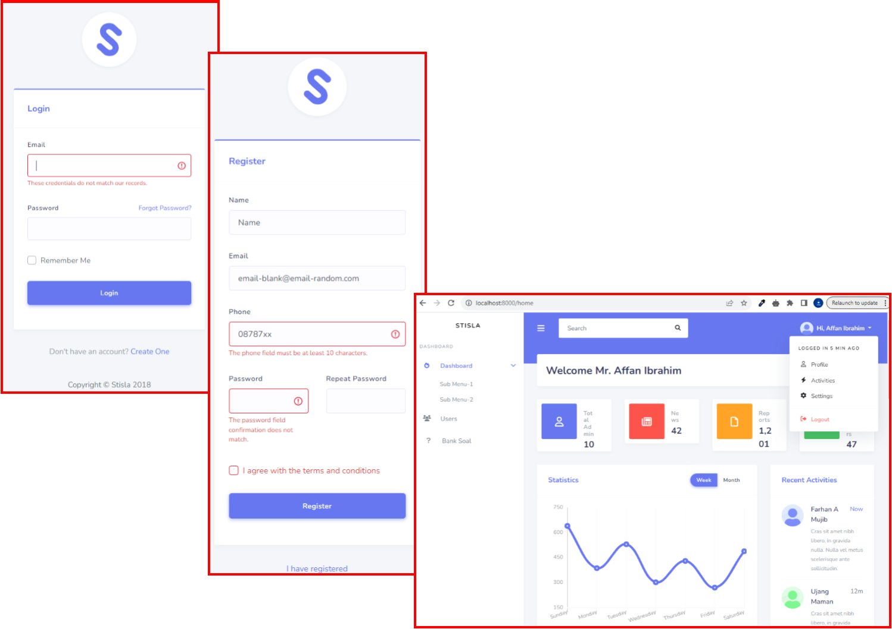
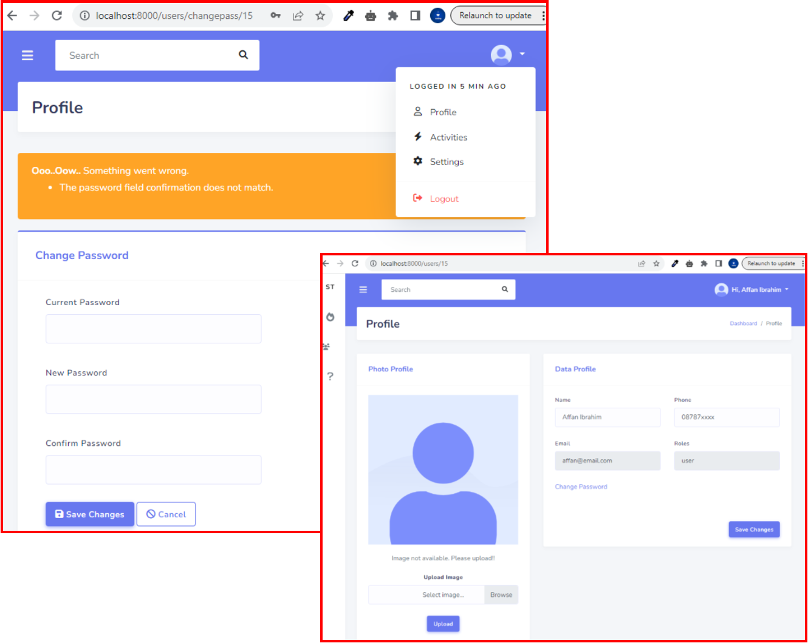
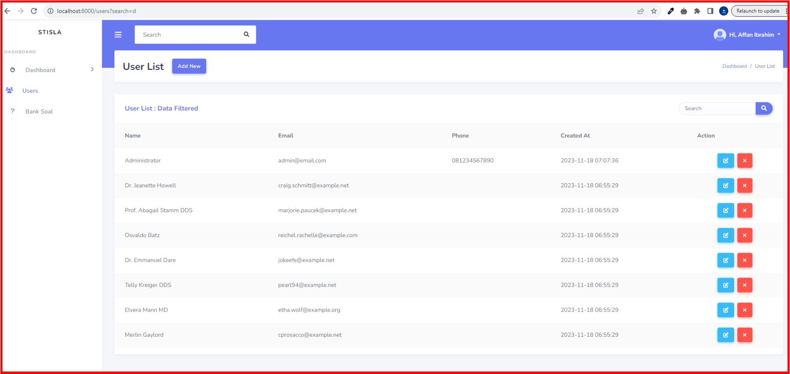
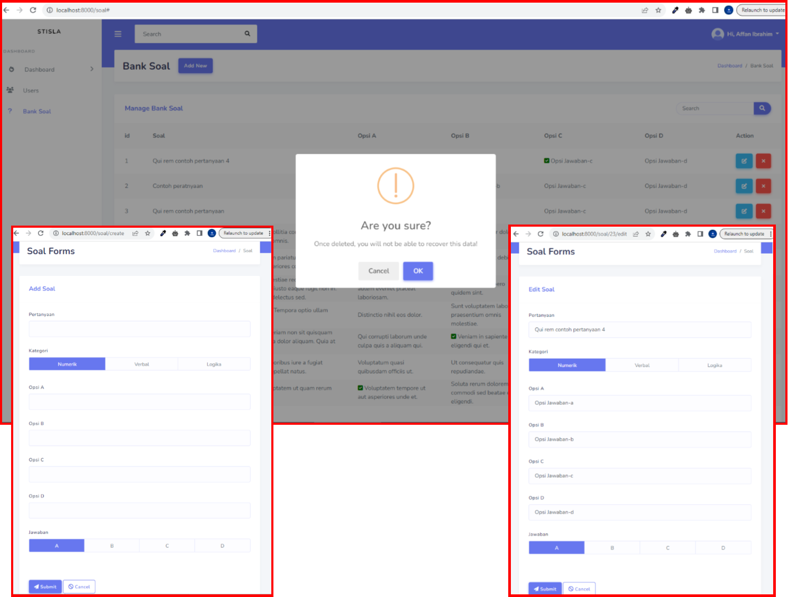

## Projek : CBT-TPA
Computer Based Training - Test Potensi Akademik 

Sebuah aplikasi seperti Quiz yang di gunakan sebagai bahan pembelajaran di Flutter Intensive Class ke-10(FIC-10), yang di pandu oleh [Mas Syaiful Bahri](https://github.com/bahrie127). 

### Lebih Detail:
- Dimulai: Awal Nov-2023
- Dibuat menggunakan PHP Framework: Laravel versi 10.
- Menggunakan DB-MySQL.
- Admin template: Stisla.
- FrontEnd template: -.

### Referensi:
- [Github Project bersama Mas Syaiful Bahri--Laravel backend](https://github.com/bahrie127/laravel-cbt-backend)

## Snapshots:

